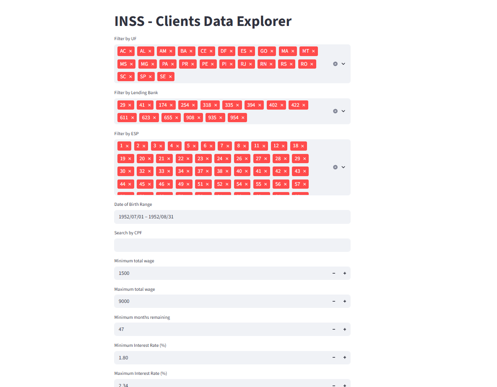
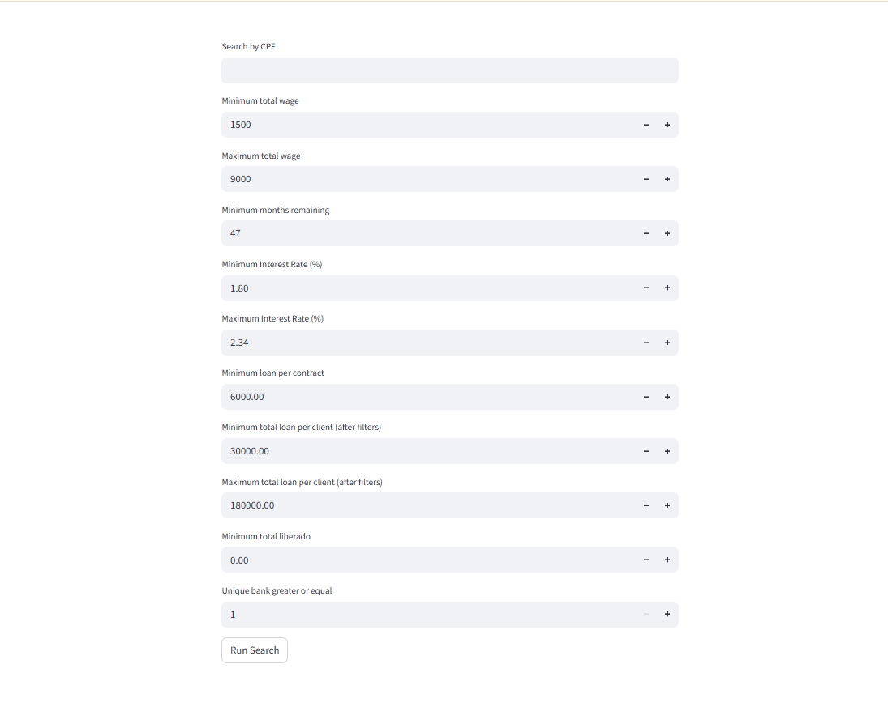
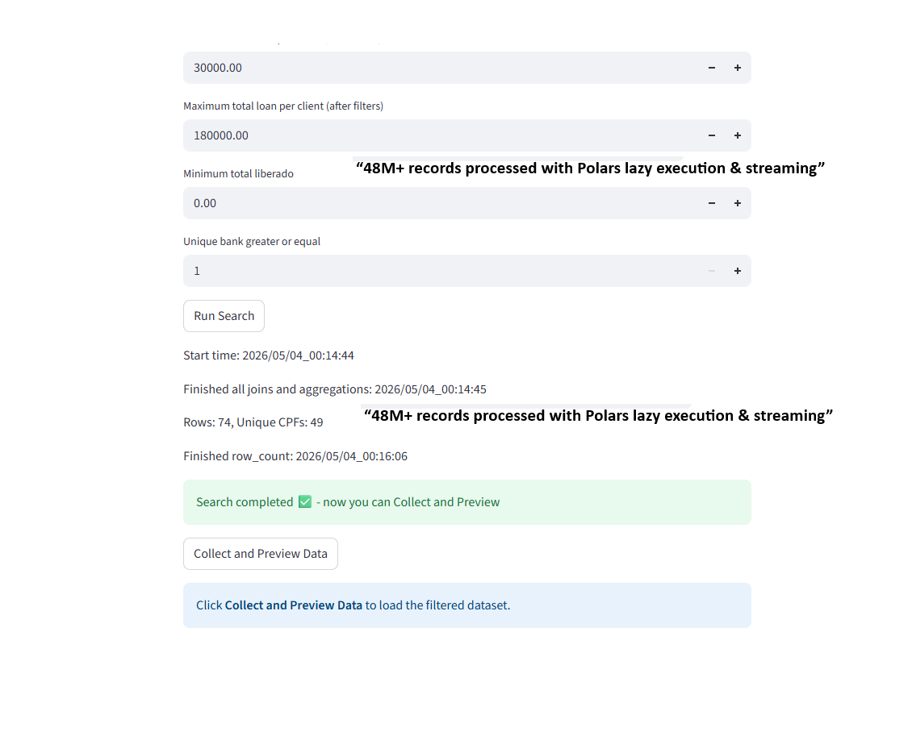
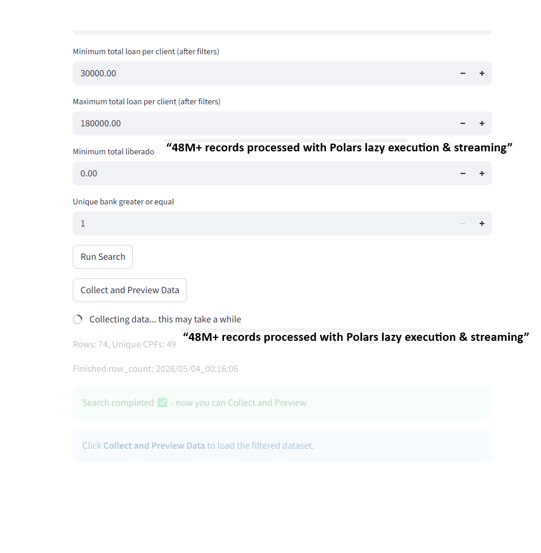
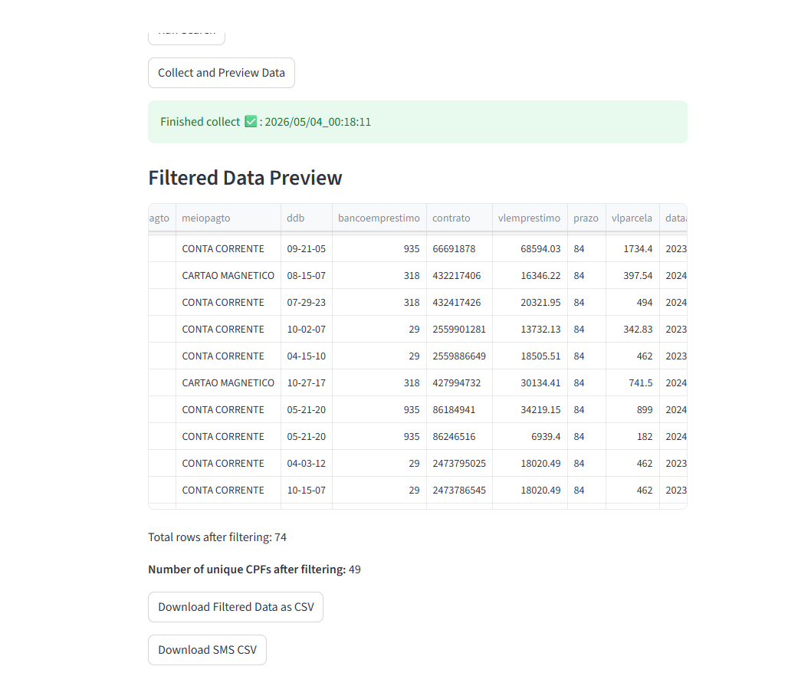

# INSS Loan Analytics Platform

A high-performance data processing platform for analyzing INSS payroll loan data and identifying refinancing and portability opportunities.

Designed to efficiently process large-scale datasets using lazy evaluation and streaming execution.  
Validated on 27 partitioned files (one per Brazilian state), totaling approximately 48 million rows while maintaining low memory usage.

---

## 🇧🇷 Versão em Português

Este projeto é uma plataforma de alta performance para análise de dados de crédito consignado do INSS.

Foi desenvolvido para processar grandes volumes de dados (dezenas de milhões de registros) utilizando execução lazy e streaming com Polars, permitindo baixo uso de memória mesmo em datasets massivos.

O objetivo é identificar oportunidades de portabilidade e refinanciamento com base em regras de negócio reais.

---

## 🚀 Overview

The platform enables financial teams to filter, analyze, and extract actionable insights from INSS loan data, supporting credit operations and client prospecting.

It combines efficient data processing with business rule application to transform raw datasets into decision-ready information.

---

## ⚙️ Key Features

* High-performance data processing using Polars (Lazy API)
* Financial calculations:

  * Outstanding balance (`saldo_devedor`)
  * Loan release values (`valor liberado`)
* Advanced filtering:

  * Bank-specific rules
  * Interest rate range
  * Remaining installments
  * Salary constraints
* Aggregations per client (CPF) and per bank
* Memory-safe processing with row limits and streaming execution
* Interactive UI for data exploration (Streamlit)
* CSV export for downstream use (e.g., SMS campaigns)

---

## 🧠 Engineering Highlights

* Designed a lazy data pipeline using Polars (`scan_parquet`) to process large datasets without loading them entirely into memory
* Implemented streaming execution to optimize memory usage and maintain performance at scale
* Built a financial calculation engine based on real-world business rules
* Structured the data flow into clear stages: preprocessing, enrichment, filtering, and aggregation
* Applied dynamic business rules per bank (e.g., minimum paid installments)
* Precomputed aggregations to improve responsiveness
* Implemented safeguards such as row limits and preview modes to prevent excessive memory usage
* Developed a user-facing interface for non-technical users to explore and export data
* Optimized performance to handle large datasets with minimal memory usage using lazy evaluation and streaming execution

---

## 🏗️ Architecture

The application follows a data pipeline approach:

1. **Data Ingestion**

   * Parquet files loaded lazily using Polars

2. **Preprocessing**

   * Data cleaning and normalization
   * Date transformations
   * Domain-specific adjustments

3. **Enrichment**

   * Calculation of derived fields:

     * Elapsed months
     * Remaining months
     * Financial metrics

4. **Filtering**

   * Dynamic filters based on user input and business rules

5. **Aggregation**

   * Grouping by CPF and bank
   * Calculation of totals and metrics

6. **Output**

   * Interactive preview
   * Export to CSV

---

## 🧪 Data Processing Strategy

To ensure performance and scalability:

* Lazy evaluation defers execution until necessary
* Streaming collection prevents memory overload
* Aggregations are optimized using Polars
* Dataset size is controlled using safeguards (row limits)

---

## 🛠️ Tech Stack

* **Python**
* **Polars** (Lazy API)
* **Streamlit**
* **Parquet**

---

## 📊 Use Case

This platform is designed for financial operations teams working with INSS payroll loans.

It enables:

* Identification of clients eligible for refinancing or portability
* Segmentation based on financial and contract conditions
* Generation of ready-to-use datasets for outreach campaigns (e.g., SMS or WhatsApp)

The system bridges raw financial data and actionable business decisions.

---

## ⚠️ Synthetic Data Disclaimer

This project uses a **synthetic dataset** generated for demonstration purposes.

* No real personal or financial data is included
* All identifiers (CPF, NB, names, phone numbers) are artificially generated
* The dataset preserves **structural and business relationships** to simulate real-world scenarios
* Some values (e.g., loan distributions, interest rates, contract patterns) are **simplified and may not fully reflect real-world behavior**

The purpose of this dataset is to:

* Demonstrate the platform's data processing capabilities
* Validate business rules and filtering logic
* Showcase performance with large-scale data

This dataset is **not intended for real financial analysis or decision-making**

---

## 📸 Screenshots

### Filters Interface





### Data Preview and Export


---

## ▶️ How to Run

1. Clone the repository:

```bash
git clone https://github.com/prteodoro/INSS-Loan-Analytics-Platform.git
cd INSS-Loan-Analytics-Platform
```

2. (Optional) Create and activate a virtual environment:

```bash
python -m venv venv
venv\Scripts\activate
```

3. Install dependencies:

```bash
pip install -r requirements.txt
```

4. Ensure the sample data is available:

The project includes a synthetic dataset located at:

```
sample_data/synthetic_clients.parquet
```

5. Run the application:

```bash
cd src  # navigate to the application folder
streamlit run app.py
```

---

## 🚀 Roadmap

* Add structured logging for better observability
* Implement unit and integration tests
* Modularize the codebase (services, pipelines)
* Build an API layer for external integrations
* Deploy in a cloud environment

---

## 📚 What I Learned

* Designing efficient data pipelines for large datasets
* Applying business rules in real-world financial contexts
* Optimizing performance using lazy execution and streaming
* Building tools that connect technical systems with business needs

---

## 📎 Live Demo

*(Coming soon)*

---

## 💡 Notes

This project is based on real-world financial scenarios and business rules, using a synthetic dataset for demonstration.

---

## 🤝 Contributions

This is a personal project focused on learning and solving real-world problems. Feedback and suggestions are welcome.
